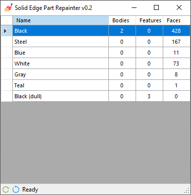
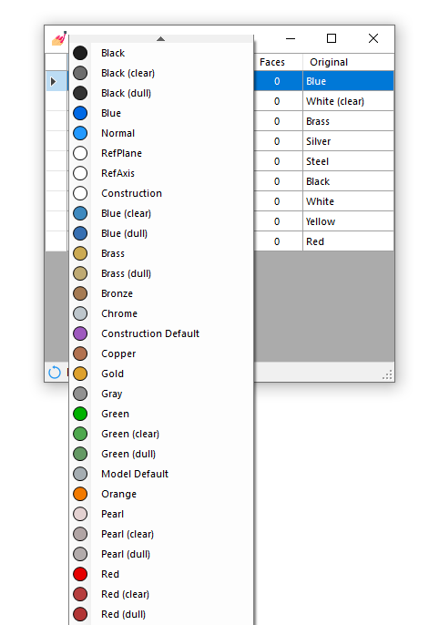

# Solid Edge PartRepainter

Solid Edge tool that helps to repaint parts by the concept to replace existing body, feature, and face styles with another style
At the startup, the tool analyzes the active part and creates a table with used styles and corresponding assigned elements

To change the style right-click the corresponding row and choose from the list of available styles

Hovering the mouse on the row header will highlight the corresponding geometry

The status bar contains:
- button to refresh the table (in case you switch to another part)
- button to restore initial styles
- a progress bar

Releases here: https://github.com/farfilli/Solid-Edge-Part-RePainter/releases

Contributors are very welcome!

Francesco
